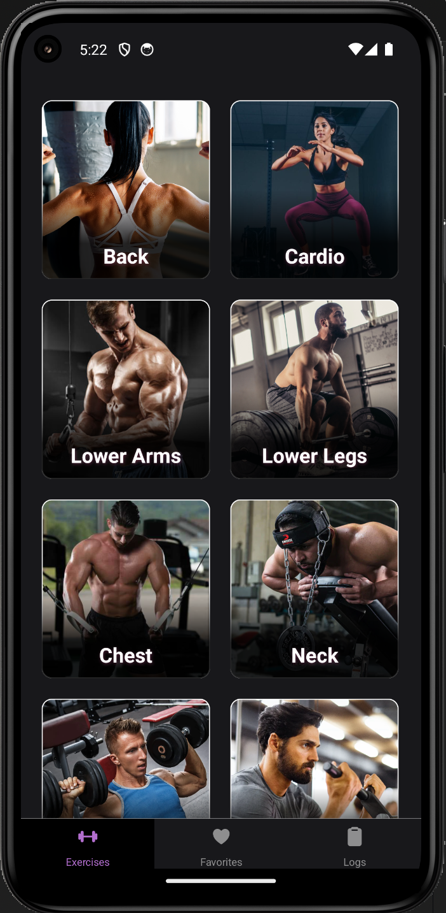
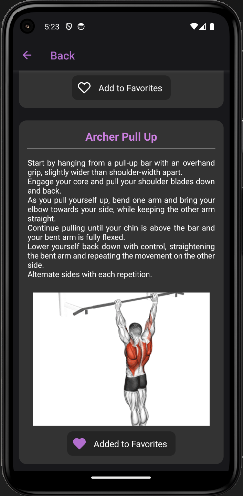
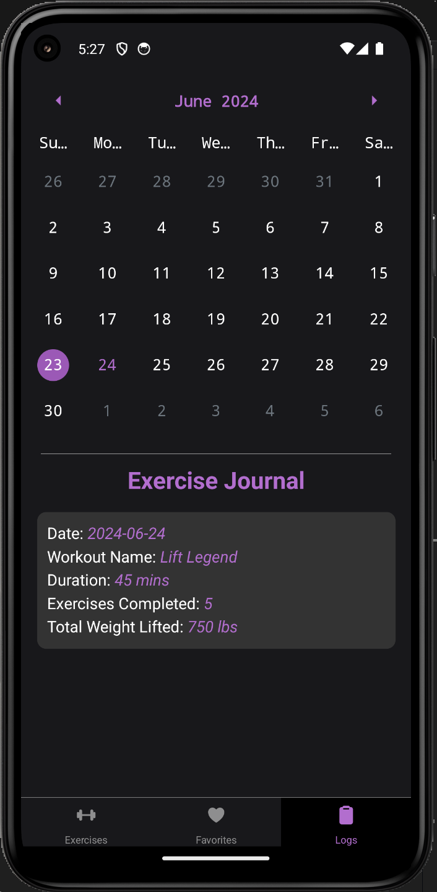

# Fitness App

This app is a React Native project developed for my bootcamp to earn an Honorary Certificate. It uses RapidAPI to fetch the exercises data. Get the API key from here: https://rapidapi.com/justin-WFnsXH_t6/api/exercisedb 

# Features

1. **Browse Exercises:** List of exercises with detailed instructions.
   
2. **Favorites:** Save and access your favorite workouts.
   
3. **Progress Tracker:** Log your workouts and track your fitness progress over time.

# Screenshots

